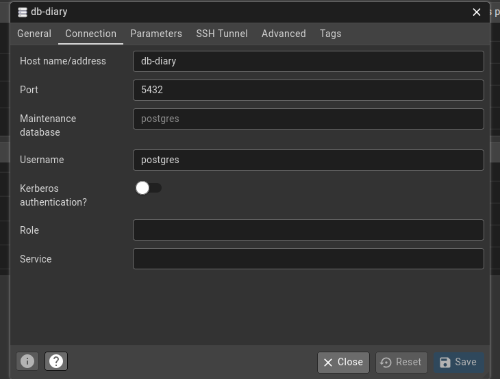

## Instalação
```bash
composer install && npm install
cp .env.example .env
sudo chmod 777 storage
cp docker/.env.dev docker/.env
php artisan migrate
```

## Iniciar aplicação
```bash
composer run dev
```

## Configurar o pgAdmin
Para conecatr o pgAdmin ao banco de dados, insira as configurações conforme exemplo abaixo:


